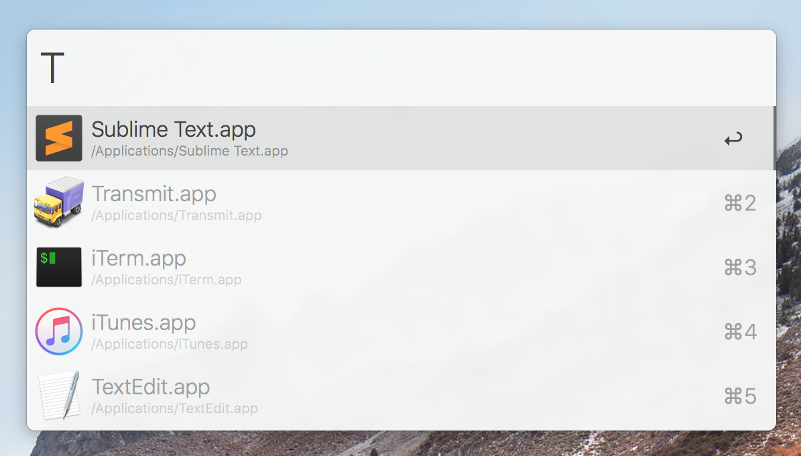
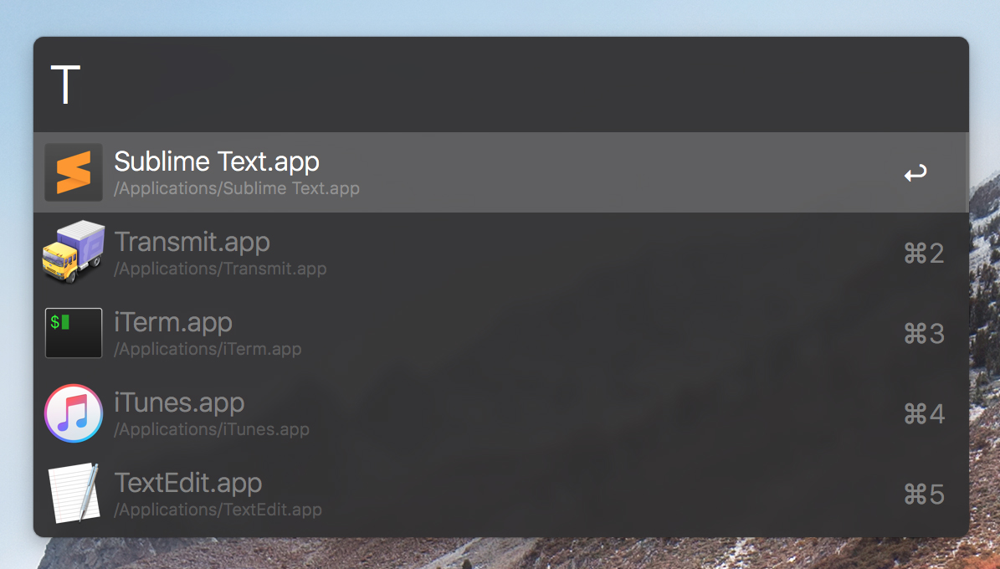

# Alfred Powerpack Themes

Here's a collection of Alfred Powerpack Themes that I built for personal use. 
Feel free to use them too...

## Installation

You have two options when it comes to installation and both options are available under each Preview.

1. **Open** - You'll be redirected to official Alfred's site, to a specific url where I shared my theme. From their page, you can "Open theme in Alfred", confirm and a theme will be installed and applied.
2. **Download** - You'll be redirected to the "RAW" file where you can save the file from your browser and once downloaded, double click it and a theme will be installed and applied in.

## Previews

### macOS Light

  

  

  

### macOS Dark

  

  

  

